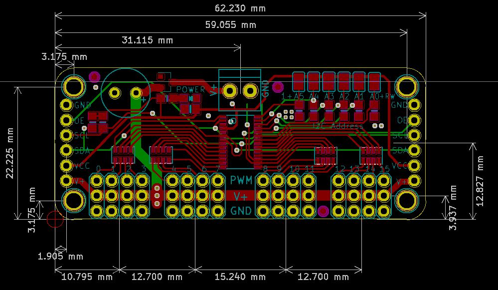

# sc92fw40-24-16-pwm-servo-driver-board
##  写在之前

​	在机器人控制方面，实际最重要的是控制舵机关节，而控制多路舵机，在创客行业用的最多的是NXP公司的16路pwm控制led灯的芯片[PCA9685](http://www.nxp.com/documents/data_sheet/PCA9685.pdf)。通过控制PWM占空比来间接控制舵机，并且这个方案非常成熟，创客行业应用很多，几乎是开源主控arduino，microbit，Raspberry Pi，ESP32得最佳搭档。但是自从芯片缺货以来PCA9685从原来4~5元上涨到目前15元左右，且被中间商囤货。导致对创客行业影响很大，那么真的没有替代得方案了吗？经过空想君近半年的研究，寻找发现TI的[TLC5944](https://www.ti.com/lit/ds/symlink/tlc5944.pdf)可以替代，但是经过资料查找这颗芯片使用的控制时序比较麻烦，几乎找不到用户使用信息，且是国外芯片，基本不敢去踩坑。经过半年时间寻找，只好放弃被动器件控制，目光转向了带MCU的PWM输出。这样选择就很多了，STM32/GD 103系类64pin引脚的基本都能输出16路以上pwm。另外还找到宏晶公司的STC8G2SK32/64系列能够输出45路pwm，但是显然使用它们虽然能够满足需求，但是芯片成本和开发周期压根不划算。最后在一次展会上我无意看到了赛元微电子出品的SC92fw40-24-16系列51内核的单片机，竟然能够输出16/24/40路pwm。和他们销售详聊了解到他们原本这个芯片是主攻LED控制市场，但是由于价格原因，还有舞台灯光现在有很多使用ws2812类似灯珠，这个芯片市场接受度并不高，且今年受产能影响，这个芯片并没有大规模量产，目前是属于缺货状态。后面邀请他们市场，销售以及代理坐下来详细聊了一下，和他提出我来基于这个芯片做机器人控制生态的构想，希望他们对颗芯片恢复产能。得益于市场部总监之前对开源创客，机器人行业比较熟悉，一说就明白我的意图，表示愿意配合，感谢赛元的代理从他们客户手里（原厂已经没有样品了）拿了几个样片给我测试。于是我开始这颗芯片的替代之旅。

## 样板设计
[原理图](./hardware/sc92fw24.pdf)

## 开发计划

打勾的代表已经实现并验证，没有打勾的代表正在开发中，期待更多开发者一起维护
- [x] [开发16-channel-pwm驱动控制板]()
- [ ] [I2C控制固件开发兼容PCA9685]()
- [ ] [arduino uno验证]()
- [ ] [microbit验证]()
- [ ] [树莓派验证]()
- [ ] [esp8266/esp32验证]()
- [ ] [51单片机验证]()
- [ ] [stm32单片机验证]()
- [ ] (24-pwm机器人通用控制板)

## 感谢

